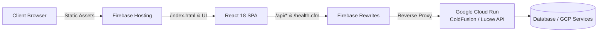

# 🍺 CF-Brews Frontend

> A modern, responsive web dashboard and intelligence platform for brewery operations, production tracking, and AI-driven insights.

[](https://reactjs.org/)
[](https://tailwindcss.com/)
[](https://firebase.google.com/)
[](https://cloud.google.com/run)

---

## 📖 Overview

**CF-Brews Frontend** is the single-page application (SPA) dashboard for the CF-Brews ecosystem. Built with **React 18** and styled with **Tailwind CSS**, it interfaces with a serverless **ColdFusion / Lucee** backend hosted on Google Cloud Run to provide real-time brewery management, fermentation monitoring, predictive analytics, and an integrated AI assistant.

---

## ✨ Features

- 📊 **Executive Dashboard & Analytics**: High-level KPIs, fermentation trends, batch throughput, and revenue metrics.
- 🤖 **AI Brewery Assistant**: Conversational assistant for querying batch history, recipe suggestions, and operational troubleshooting.
- 🧪 **Brewery Operations**:
  - **Batch Management**: Track brews through mashing, boiling, fermentation, and conditioning.
  - **Recipe Formulation**: Manage hop/grain profiles, target ABV, and IBU specifications.
  - **Vat & Tank Monitoring**: Live capacity, temperature, and status tracking across fermentation vessels.
  - **Inventory Tracking**: Monitor raw ingredients, packaging materials, and stock alerts.
- 🔮 **Predictive AI**: Forecast demand, fermentation duration, and ingredient reorder thresholds.
- 👥 **Customer 360 & Brewery Directory**: Customer interaction insights and regional brewery exploration.
- 🛡️ **Offline & Resilient Mode**: Built-in mock data fallback allowing testing and exploration even when disconnected from the backend.

---

## 🏗️ Architecture & Data Flow



- **Static Hosting**: Served via [Firebase Hosting](firebase.json) with single-page app rewrite rules.
- **API Rewrites**: Firebase redirects `/api/**` and `/health.cfm` to the Cloud Run backend service in `us-central1`.
- **Health Monitoring & Offline Grace**: `apiUtils.js` checks backend connectivity and broadcasts status events, falling back gracefully to mock datasets when offline.

---

## 📁 Project Structure

```text
cf-brews-frontend/
├── public/              # Static public assets and index.html
├── src/
│   ├── components/      # Reusable UI components (Sidebar, PageContent, Cards)
│   ├── data/            # Fallback/mock data for offline demo mode
│   ├── pages/           # Application views
│   │   ├── Analytics.jsx
│   │   ├── Batches.jsx
│   │   ├── BreweryAssistant.jsx
│   │   ├── Customer360.jsx
│   │   ├── Dashboard.jsx
│   │   ├── Inventory.jsx
│   │   ├── PredictiveAI.jsx
│   │   ├── Recipes.jsx
│   │   └── Vats.jsx
│   ├── apiUtils.js      # Resilient API fetch helpers with retry logic
│   ├── app.jsx          # Root layout and global status provider
│   └── index.js         # React entrypoint
├── cloudbuild.yaml      # GCP CI/CD deployment pipeline
├── firebase.json        # Firebase Hosting routing & rewrites configuration
├── tailwind.config.js   # Tailwind design tokens and theme
└── package.json
```

---

## 🚀 Getting Started

### Prerequisites

- [Node.js](https://nodejs.org/) (v18 or higher recommended)
- `npm` or `yarn`

### Installation

1. Clone the repository and navigate to the frontend directory:
   ```bash
   git clone https://github.com/SnipeTHH/cf-brews.git
   cd cf-brews/cf-brews-frontend
   ```

2. Install dependencies:
   ```bash
   npm install
   ```

### Running Locally

To start the local development server:

```bash
npm start
```

Open [http://localhost:3000](http://localhost:3000) to view it in your browser.

> **Note**: If running without the local backend container, the frontend will automatically use its internal demo data fallback.

---

## 🛠️ Available Scripts

| Command | Description |
| :--- | :--- |
| `npm start` | Runs the app in development mode with live reloading at `localhost:3000`. |
| `npm run build` | Builds the production-ready bundle into the `build/` folder. |
| `npm test` | Launches the test runner in interactive watch mode. |

---

## 🚢 Deployment

Deployments are automated via **Google Cloud Build** and **Firebase Hosting**:

1. **Automated CI/CD**: Pushes trigger [`cloudbuild.yaml`](cloudbuild.yaml) to install dependencies, run `npm run build`, and deploy hosting targets via the Firebase CLI.
2. **Manual Deploy**:
   ```bash
   npm run build
   firebase deploy --only hosting
   ```

---

## 🤝 Related Repositories

- [cf-brews-backend](https://github.com/SnipeTHH/cf-brews-backend): Adobe ColdFusion / Lucee API microservices running on Google Cloud Run.
